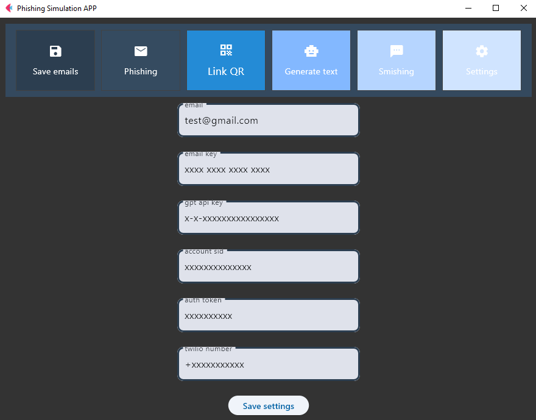

# Phishing Simulation

## Brief Description

It is a simple application that allows you to simulate a phishing attack. It allows you to send multiple emails at once and check the statistics of how many users clicked on a suspicious link. You can also send Smishing messages, send emails with QR code and generate phishing text with AI.

## Functionality

- Sending multiple phishing emails at once.
- Sending emails with QR code.
- Sending Smishing messages
- Generate phishing text with AI.
- Checking the statistics of the simulation

## Technologies

- Python
- Flask
- Flet

## Installation

pip install -r requirements.txt

## Usage

- Start `fletApp.py`
- Navigate to Settings
- Set API keys for all the features you want to use: [Explanation](#how-to-set-up-api-keys-and-tokens)
- run flask app `flask --app app run` - run simulation, check stats

## How to set up API Keys and Tokens
### &nbsp; &nbsp; Sending emails
- Create a gmail account
- Set App Password: https://myaccount.google.com/apppasswords
- Paste your e-mail adress and app password to fletApp settings
### &nbsp; &nbsp; Generating phishing text with OpenAI
- Unfortunately its no longer free
- Go to https://platform.openai.com/ and create an account
- Paste your e-mail adress and app password to fletApp settings
- Set up billing method and pay them 5 dollars for some API tokens.
- Create API Key https://platform.openai.com/organization/api-keys and past it to fletApp settings
You can also generate it for free on their website. 
### &nbsp; &nbsp; Sending Smishing messages
- Create an account on twilio.com
- Navigate to console.twilio.com
- Scroll down and copy Account SID, Auth Token and My Twilio phone number
- Paste it to fletApp settings

## TODO

- Host website

